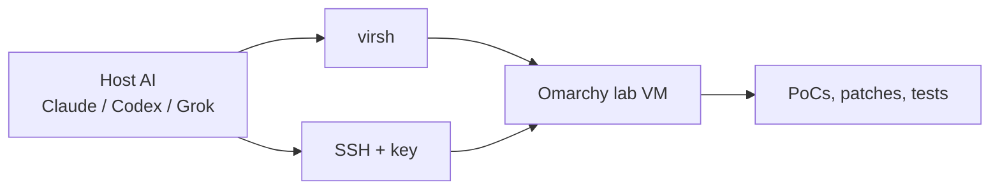

Omarchy is a pleasure as a daily driver. It is still a bad place to run a security PoC.

`omarchy dev link` is how you develop Omarchy: it points the running desktop at a checkout after reboot. Use it. The problem is not the link. The problem is running an untrusted plugin, a lock-screen reproducer, or a half-written shell against the session you are sitting in. If Quickshell dies, you are debugging a black screen with the same machine that just died.

I wanted a second Omarchy I could break, snapshot, and hand to a coding agent. A KVM guest on the same PC, driven from the host over SSH.



The host keeps the editor and the agent. The guest is where `omarchy dev link` and the reproducers run. The agent can start the VM, copy a checkout, run a PoC, take a screenshot, and roll the disk back. A wedged guest is `reset`. The host session stays up.

## Check for KVM

This is the same class of guest the [official ISO acceptance harness](https://github.com/omacom/omarchy-iso) already uses: OVMF, Q35, `cpu host`, virtio disk/nic/vga.

Check the host before installing anything:

```bash
lscpu | grep -E 'Virtualization|Model name'
ls -l /dev/kvm
```

You want `AMD-V` or `VT-x`, and a `/dev/kvm` node. Nested KVM is a bonus (`cat /sys/module/kvm_amd/parameters/nested` or `kvm_intel`), not a requirement.

## 1. Hypervisor on the host

On Omarchy:

```bash
omarchy pkg add qemu-full libvirt virt-manager virt-viewer dnsmasq edk2-ovmf cdrtools swtpm
sudo usermod -aG libvirt,kvm "$USER"
sudo systemctl enable --now libvirtd.service
sudo virsh net-start default
sudo virsh net-autostart default
```

Omarchy's host firewall is on by default (`INPUT` and `FORWARD` drop). The `default` NAT lives on `virbr0`; without an allow, the guest's DHCP never reaches dnsmasq and you get a link-up ethernet with only an `fe80:` address.

Do not `ufw allow in on virbr0` with no port. That lets the guest hit every host service bound on `0.0.0.0` (SSH, epmd, a local Tableau, …). Do not `ufw route allow in on virbr0` with no egress interface either: that forwards the guest onto your LAN. Open only DHCP/DNS to the bridge, and forward only toward the uplink (here `wlp9s0` — use `ip -o route show default`):

```bash
WAN=$(ip -o route show default | awk '{print $5; exit}')

# DHCP discover is broadcast to 255.255.255.255:67, not 192.168.122.1.
# A destination-restricted rule never matches, and UFW then drops port 67.
sudo ufw allow in on virbr0 proto udp to any port 67 comment 'libvirt dhcp'
sudo ufw allow in on virbr0 to 192.168.122.1 port 53 proto udp comment 'libvirt dns'
sudo ufw allow in on virbr0 to 192.168.122.1 port 53 proto tcp comment 'libvirt dns'
sudo ufw route allow in on virbr0 out on "$WAN" comment 'libvirt nat'
```

Return traffic is already `RELATED,ESTABLISHED`. Host → guest SSH is outbound from the host and does not need an extra INPUT rule.

If the guest already booted into that hole, bounce the libvirt network once so NAT masquerade reinstalls, then reconnect ethernet in the guest (`nmcli -w 15 device connect enp1s0`, or Super+Ctrl+W). For a PoC that should not phone home, skip the `route allow` and leave `FORWARD` dropped.

Log out and back in so the groups apply. `newgrp libvirt` is enough for the current shell.

Unprivileged `virsh` and `virt-install` default to `qemu:///session`, which has no NAT named `default`. Pin the system URI so they match the network you just started:

```bash
mkdir -p ~/.config/libvirt
printf 'uri_default = "qemu:///system"\n' > ~/.config/libvirt/libvirt.conf
```

Confirm you can talk to system libvirt without sudo:

```bash
virsh uri   # qemu:///system
virsh list --all
```

## 2. ISO

Pin a release, then check the hash. At the time of writing that is 4.0.2:

```bash
mkdir -p ~/VMs/omarchy-lab
cd ~/VMs/omarchy-lab
curl -LO https://iso.omarchy.org/omarchy-4.0.2.iso
curl -LO https://iso.omarchy.org/omarchy-4.0.2.iso.sha256
sha256sum -c omarchy-4.0.2.iso.sha256
```

Grab a newer ISO from [omarchy.org](https://omarchy.org) when one ships. The VM shape below does not change.

## 3. Create the guest

This matches the official unattended-install / ISO-test shape, plus a software TPM:

`virt-install` is a Python script with `#!/usr/bin/env python3`. If mise (or pyenv) puts another Python first on `PATH`, it will fail with `No module named 'gi'`. Call the system interpreter explicitly:

`qemu:///system` runs QEMU as `libvirt-qemu`. A `700` home directory is correct; do not punch a search ACL through it. That user would then be able to read every `644` file under any `755` directory in `$HOME` (typical with umask `022`: `~/.config`, `~/.aws`, `~/Work`, …). Keep the disk and ISO in libvirt's image pool instead:

```bash
sudo mkdir -p /var/lib/libvirt/images
sudo qemu-img create -f qcow2 /var/lib/libvirt/images/omarchy-dev.base.qcow2 80G
sudo mv ~/VMs/omarchy-lab/omarchy-4.0.2.iso /var/lib/libvirt/images/

/usr/bin/python3 /usr/bin/virt-install \
  --connect qemu:///system \
  --name omarchy-dev \
  --memory 16384 \
  --vcpus 8 \
  --cpu host-passthrough \
  --machine q35 \
  --os-variant archlinux \
  --boot loader=/usr/share/edk2/x64/OVMF_CODE.4m.fd,loader.readonly=yes,loader.type=pflash,nvram.template=/usr/share/edk2/x64/OVMF_VARS.4m.fd \
  --tpm backend.type=emulator,backend.version=2.0,model=tpm-crb \
  --disk path=/var/lib/libvirt/images/omarchy-dev.base.qcow2,format=qcow2,bus=virtio,cache=writeback,discard=unmap \
  --cdrom /var/lib/libvirt/images/omarchy-4.0.2.iso \
  --network network=default,model=virtio \
  --graphics spice \
  --video virtio \
  --channel spicevmc \
  --input tablet,bus=usb \
  --noautoconsole
```

Open the console:

```bash
virt-viewer --attach omarchy-dev
```

Give it 8 vCPUs and 16 GiB if the host can spare them. Under-spec guests make Hyprland look broken when the firmware was the actual problem.

### Installer settings that matter

| Setting | Lab choice |
|---|---|
| Firmware | UEFI (`OVMF_CODE.4m.fd`). SeaBIOS never reaches the configurator. |
| TPM | Software TPM 2.0 (`swtpm` → `/dev/tpm0`). Not the host's chip. |
| Disk | The virtio disk. Nothing passthrough. |
| Encryption | Skip it. `Ctrl+C` on the disk-warning screen. A lab that cannot reboot without a typed LUKS passphrase cannot be driven by an agent. |
| Network | libvirt `default` NAT. Do not bridge the guest onto your LAN. |

Encryption is the right default on a laptop you can lose. It is the wrong default on a disposable VM whose job is "boot, run the PoC, revert."

Walk the wizard, pick a dedicated lab user (`lab`) and a password you will type once (`lab` is fine), and stay on the desktop when it reboots. A NAT guest often geo-guesses a nonsense timezone (`Africa/Abidjan` here); fix it later with `timedatectl set-timezone`. After a successful install the CDROM is often already empty. Confirm with `virsh dumpxml omarchy-dev | grep -A6 cdrom`. If the ISO is still attached:

```bash
virsh change-media omarchy-dev --eject --path /var/lib/libvirt/images/omarchy-4.0.2.iso || true
```

The `--tpm` flag is libvirt starting [swtpm](https://github.com/stefanberger/swtpm). After first boot you should have `/dev/tpm0` and `/dev/tpmrm0`. `tpm2-tools` is not on a stock ISO; install it in the guest if you need `tpm2_getcap`. Do not pass through the host's `/dev/tpm0`. Emulator state lives under `/var/lib/libvirt/swtpm/` on the host. `omarchy-lab reset` does not wipe that directory.

## 4. SSH that an agent can use

The guest should still be on the desktop from step 3. If you already powered it off, `virsh start omarchy-dev` and log in as `lab`.

Stock Omarchy ships OpenSSH disabled and the port closed. That is correct on a real machine. On the lab it is the whole point of the guest.

Inside the guest, once, as the lab user:

```bash
mkdir -p ~/.ssh
chmod 700 ~/.ssh
# paste the host's lab key, not your GitHub key
nano ~/.ssh/authorized_keys
chmod 600 ~/.ssh/authorized_keys

echo "$USER ALL=(ALL) NOPASSWD: ALL" | sudo tee /etc/sudoers.d/lab
sudo chmod 440 /etc/sudoers.d/lab

sudo systemctl enable --now sshd
sudo ufw allow from 192.168.122.1 to any port 22 proto tcp
```

Passwordless sudo is a lab convenience. Agents hang on a password prompt. Do not copy this to the host.

Unencrypted Omarchy still stops at SDDM. For an agent that reboots the guest, autologin the lab user (encrypted installs already do this; LUKS is the gate):

```bash
printf '[Autologin]\nUser=lab\nSession=omarchy.desktop\n' | sudo tee /etc/sddm.conf.d/autologin.conf
```

That is lab-only. A machine without LUKS and with autologin is unlocked on the couch.

On the **host**, a key that exists only for this VM:

```bash
ssh-keygen -t ed25519 -f ~/.ssh/omarchy-lab -C omarchy-lab -N ""
```

Put `~/.ssh/omarchy-lab.pub` in the guest `authorized_keys` you just edited. Then a host SSH config:

```sshconfig
Host omarchy-lab
  User lab
  IdentityFile ~/.ssh/omarchy-lab
  IdentitiesOnly yes
  StrictHostKeyChecking accept-new
  UserKnownHostsFile ~/.ssh/omarchy-lab.known_hosts
  ControlMaster auto
  ControlPath ~/.ssh/cm-%r@%h:%p
  ControlPersist 10m
```

Leave `HostName` out until you know the lease. Then:

```bash
virsh domifaddr omarchy-dev --source lease
```

Add `HostName 192.168.122.N` once it is stable, or let the wrapper below fill it in.

The installer can do the key and `sshd` part for you if you attach a `cidata` volume with `authorized_keys`. That is the [unattended install](https://omarchy.org/manual/unattended-installs/) path. For a single lab VM, pasting one key by hand is less work than synthesizing a valid `user_configuration.json`.

## 5. Gold image, then throwaway overlays

Do not freeze gold until SSH, passwordless sudo, and autologin all work. That packaged disk is what `reset` returns — not a checkout. Then shut the guest off and keep `omarchy-dev.base.qcow2`. `virsh shutdown` will not do it: Omarchy sets `HandlePowerKey=ignore`, so use `sudo systemctl poweroff` in the guest or `virsh destroy` from the host. Each experiment then `dev link`s the checkout under test on an overlay, and `reset` returns you to stock.

Every experiment is an overlay, the same trick the ISO test harness uses. Create it through libvirt so you do not need `sudo` on `/var/lib/libvirt/images`. The pool name is whatever owns that path (`images-1` on this host — check with `virsh pool-list` and `virsh pool-dumpxml`):

```bash
virsh vol-create-as images-1 omarchy-dev.qcow2 80G --format qcow2 \
  --backing-vol omarchy-dev.base.qcow2 --backing-vol-format qcow2
```

Point the domain at the overlay (guest must be off):

```bash
virsh dumpxml omarchy-dev > /tmp/omarchy-dev.xml
# change the disk source file to omarchy-dev.qcow2
virsh define /tmp/omarchy-dev.xml
virsh start omarchy-dev
```

After that, reset is `omarchy-lab reset`, which deletes and recreates the overlay volume.

A wrecked compositor, a half-applied patch, a plugin that wedged Quickshell: delete the overlay. The gold image does not move.

## 6. What the guest is allowed to see

This is the security-sensitive part. A shell plugin on Omarchy runs as your user. If you virtiofs-share `$HOME` into the guest, a PoC that reads files is reading the host.

Rules that have held up:

- **Do not** share the host home, `~/.config`, `~/.ssh`, `~/.gnupg`, or 1Password sockets.
- **Do not** run the reproducer against the host session, even if that session is also `dev link`ed.
- **Do not** bridge the guest onto the LAN. libvirt NAT is one-way enough: the guest can fetch packages, nothing on the LAN can dial in.
- **Do not** put your GitHub org key in the guest. A deploy key limited to your Omarchy fork, or HTTPS + a fine-grained token, is enough.
- **Do not** turn Tailscale on in the guest while you are running a network-facing reproducer.
- Share at most one directory: a dedicated checkout, for example `~/Work/omarchy-lab` on the host. rsync is simpler and easier to reason about than virtiofs.

Copy work in, run it, copy artifacts out. That is the whole data path.

## 7. A wrapper the host AI can call

Agents are good at running a small CLI and bad at improvising libvirt XML. Put this on the host as `~/VMs/omarchy-lab/bin/omarchy-lab` and symlink it onto `PATH`:

```bash
#!/usr/bin/env bash
# Drive the disposable Omarchy KVM from the host.
set -euo pipefail

NAME=omarchy-dev
CONNECT=qemu:///system
USER=lab
KEY="${HOME}/.ssh/omarchy-lab"
POOL="${POOL:-}"
BASE_VOL=omarchy-dev.base.qcow2
OVERLAY_VOL=omarchy-dev.qcow2
SCREEN_DIR="${HOME}/VMs/omarchy-lab/screens"

virsh() { command virsh --connect "$CONNECT" "$@"; }

if [[ -z $POOL ]]; then
  while read -r p; do
    [[ -n $p ]] || continue
    if virsh pool-dumpxml "$p" 2>/dev/null | grep -q '/var/lib/libvirt/images</path>'; then
      POOL=$p
      break
    fi
  done < <(virsh pool-list --all --name)
fi
[[ -n $POOL ]] || { echo "no libvirt pool for /var/lib/libvirt/images" >&2; exit 1; }

guest_ip() {
  virsh domifaddr "$NAME" --source lease 2>/dev/null \
    | awk '/ipv4/ { split($4, a, "/"); print a[1]; exit }'
}

ssh_opts=(
  -i "$KEY"
  -o IdentitiesOnly=yes
  -o StrictHostKeyChecking=accept-new
  -o UserKnownHostsFile="${HOME}/.ssh/omarchy-lab.known_hosts"
  -o BatchMode=yes
  -o ConnectTimeout=5
)

lab_ssh() {
  local ip
  ip=$(guest_ip)
  [[ -n $ip ]] || { echo "guest has no lease yet" >&2; return 1; }
  ssh "${ssh_opts[@]}" "${USER}@${ip}" "$@"
}

wait_ssh() {
  local n=0
  until lab_ssh true 2>/dev/null; do
    (( n++ < 60 )) || { echo "SSH did not come up" >&2; return 1; }
    sleep 2
  done
}

wait_off() {
  local n=0
  until virsh list --all | awk -v name="$NAME" '$2==name && $3=="shut" {found=1} END{exit !found}'; do
    (( n++ < 30 )) || return 0
    sleep 1
  done
}

wait_hypr() {
  local n=0
  until lab_ssh 'ls /run/user/$(id -u)/hypr 2>/dev/null | grep -q .'; do
    (( n++ < 45 )) || { echo "Hyprland did not start (autologin?)" >&2; return 1; }
    sleep 2
  done
}

session_env='
  export XDG_RUNTIME_DIR=/run/user/$(id -u)
  export DBUS_SESSION_BUS_ADDRESS=unix:path=$XDG_RUNTIME_DIR/bus
  export HYPRLAND_INSTANCE_SIGNATURE=$(ls -t $XDG_RUNTIME_DIR/hypr 2>/dev/null | head -1)
  export WAYLAND_DISPLAY=$(find $XDG_RUNTIME_DIR -maxdepth 1 -name "wayland-*" ! -name "*.lock" -printf "%f\n" 2>/dev/null | head -1)
  [ -f /etc/omarchy.conf ] && . /etc/omarchy.conf
  export OMARCHY_PATH="${OMARCHY_PATH:-/usr/share/omarchy}"
  export PATH="$OMARCHY_PATH/bin:$PATH"
'

cmd="${1:-help}"
shift || true

case "$cmd" in
  start)
    virsh start "$NAME"
    wait_ssh
    wait_hypr
    echo "up $(guest_ip)"
    ;;
  stop)
    lab_ssh "sudo systemctl poweroff" 2>/dev/null || virsh destroy "$NAME"
    wait_off
    ;;
  destroy)
    virsh destroy "$NAME" || true
    wait_off
    ;;
  ip)
    guest_ip
    ;;
  ssh)
    wait_ssh
    lab_ssh "$@"
    ;;
  session)
    wait_ssh
    wait_hypr
    lab_ssh "bash -lc $(printf '%q' "$session_env $*" )"
    ;;
  reset)
    virsh destroy "$NAME" 2>/dev/null || true
    wait_off
    virsh vol-delete --pool "$POOL" "$OVERLAY_VOL"
    virsh vol-create-as "$POOL" "$OVERLAY_VOL" 80G --format qcow2 \
      --backing-vol "$BASE_VOL" --backing-vol-format qcow2 >/dev/null
    virsh start "$NAME"
    wait_ssh
    wait_hypr
    echo "reset $(guest_ip)"
    ;;
  push)
    wait_ssh
    src="${1:?usage: omarchy-lab push SRC [DST]}"
    dst="${2:-/home/${USER}/omarchy}"
    src="${src%/}/"
    rsync -az --delete --exclude .git \
      -e "ssh -i ${KEY} -o IdentitiesOnly=yes -o StrictHostKeyChecking=accept-new -o UserKnownHostsFile=${HOME}/.ssh/omarchy-lab.known_hosts -o BatchMode=yes" \
      "$src" \
      "${USER}@$(guest_ip):${dst}/"
    ;;
  screenshot)
    mkdir -p "$SCREEN_DIR"
    local_ppm="${SCREEN_DIR}/$(date +%Y%m%d-%H%M%S).ppm"
    virsh screenshot "$NAME" "$local_ppm"
    if command -v magick >/dev/null; then
      magick "$local_ppm" "${local_ppm%.ppm}.png"
      rm -f "$local_ppm"
      echo "${local_ppm%.ppm}.png"
    else
      echo "$local_ppm"
    fi
    ;;
  send-key)
    virsh send-key "$NAME" "$@"
    ;;
  viewer)
    virt-viewer --connect "$CONNECT" --attach "$NAME"
    ;;
  help|*)
    cat <<'EOF'
usage: omarchy-lab <command>

  start         start the VM and wait for SSH
  stop          graceful shutdown
  destroy       power off
  reset         new overlay from the gold image, then boot
  ip            print the NAT lease
  ssh [cmd]     SSH as the lab user
  session cmd   SSH with Hyprland session env
  push SRC DST  rsync a checkout into the guest
  screenshot    capture the virtio display
  send-key ...  virsh send-key (e.g. KEY_LEFTMETA KEY_ENTER)
  viewer        attach virt-viewer
EOF
    ;;
esac
```

```bash
chmod +x ~/VMs/omarchy-lab/bin/omarchy-lab
ln -sfn ~/VMs/omarchy-lab/bin/omarchy-lab ~/.local/bin/omarchy-lab
```

`session` is the important one. A login SSH session does not inherit the graphical environment. Without `XDG_RUNTIME_DIR` and `HYPRLAND_INSTANCE_SIGNATURE`, `hyprctl` and any PoC that talks to the running shell will look at an empty bus and report a lie. Guest `omarchy capture screenshot` waits for a region (and will hang an agent). `omarchy capture screenshot fullscreen save` writes `~/Pictures/screenshot-*.png` in the guest. The reliable host-side capture is `omarchy-lab screenshot` (virsh). `omarchy-lab send-key KEY_LEFTMETA KEY_SPACE` opens the Omarchy menu.

## 8. Guest workflow: one checkout, one link

On a fresh overlay, copy a host checkout (do not pass a host-expanded `~/omarchy` as the destination — the default is `/home/lab/omarchy`):

```bash
omarchy-lab push ~/Work/omarchy
omarchy-lab ssh 'omarchy dev link /home/lab/omarchy --no-reboot && sudo reboot'
```

Wait for SSH and Hyprland (autologin), then:

```bash
omarchy-lab session 'omarchy version'
omarchy-lab session 'omarchy dev status'
```

`push` excludes `.git`, so `omarchy version` reports `dev`, not `dev (<sha>)`. Clone with git inside the guest if you need the SHA. Plain `omarchy-lab ssh 'omarchy version'` can still print the packaged version because that shell has not sourced `/etc/omarchy.conf`.

Or the agent can edit over SSH. I prefer host-side edits: the tools, the git identity, and the review all stay on the machine I trust, and the guest only ever runs the tree.

## 9. How the host AI is supposed to work

Claude Code, Codex, Grok, whatever you already run on the Omarchy host: they already have a shell. They do not need a special MCP server for this. They need instructions that make the lab the default place to execute a PoC, and the wrapper so they reboot the guest instead of the machine you are using.

Drop something like this in the host agent's project instructions, or in `AGENTS.md` of the checkout you are about to patch:

```markdown
`omarchy dev link` belongs in the guest. Run reproducers there too.

The disposable guest is `omarchy-dev`, driven by `omarchy-lab` on PATH.

- Reproduce, test, and run PoCs only inside the guest.
- `omarchy-lab reset` before an untrusted reproducer.
- `omarchy-lab push .` after edits, then
  `omarchy-lab ssh 'omarchy dev link /home/lab/omarchy --no-reboot && sudo reboot'`.
- Graphical checks: `omarchy-lab screenshot`.
- Menu: `omarchy-lab send-key KEY_LEFTMETA KEY_SPACE`.
- If the guest is wedged: `omarchy-lab reset`. Do not debug it on the host.
```

That is enough. A competent agent will then do roughly:

1. `omarchy-lab reset`
2. Push the unpatched tree, link, reboot
3. Copy the reporter's reproducer into `/tmp` in the guest, not into the host home
4. Run it with `omarchy-lab session ...`
5. `omarchy-lab screenshot` plus `journalctl --user -u omarchy-shell`
6. Push the patch, reboot, run the same reproducer, expect it to fail closed
7. Reset the overlay so the next task does not inherit a dirty shell

For a compositor-level check you still want `virt-viewer` once with your own eyes. Screenshots catch "the menu opened" and "the lock stayed up." They do not catch "this animation is 8 fps."

## 10. A patch loop that does not leak

Concrete shape I use for a shell-boundary fix. No payload, just the moving parts.

```bash
# 1. Clean guest, unpatched checkout
omarchy-lab reset
omarchy-lab push ~/Work/omarchy
omarchy-lab ssh 'omarchy dev link /home/lab/omarchy --no-reboot && sudo reboot'
omarchy-lab ssh true   # wait

# 2. Reproducer lives in the guest only
omarchy-lab ssh 'mkdir -p /tmp/repro'
scp -F none -i ~/.ssh/omarchy-lab \
  /path/to/reporter-repro.sh lab@$(omarchy-lab ip):/tmp/repro/
omarchy-lab session 'bash /tmp/repro/reporter-repro.sh' || true
omarchy-lab screenshot
omarchy-lab ssh 'journalctl --user -u omarchy-shell -b --no-pager | tail -n 80'

# 3. Apply the patch on the host, push, relink
# (edit ~/Work/omarchy-lab, commit there)
omarchy-lab push ~/Work/omarchy
omarchy-lab ssh 'sudo reboot'
omarchy-lab ssh true

# 4. Same reproducer, now against the patched shell
omarchy-lab session 'bash /tmp/repro/reporter-repro.sh'
omarchy-lab screenshot

# 5. Forget the overlay
omarchy-lab reset
```

The host never executes the reproducer. The gold image never keeps it. The screenshot directory on the host is the only durable artifact, and it is a picture of a VM display, not a copy of the payload.

If the finding is network-facing, freeze outbound traffic for the run:

```bash
omarchy-lab ssh 'sudo ufw default deny outgoing && sudo ufw allow out 22'
# ...run the reproducer...
omarchy-lab reset
```

Reset is simpler than remembering to re-open the firewall.

## 11. Things that will waste an afternoon

**`No module named 'gi'` from virt-install.** Mise/pyenv Python is ahead of `/usr/bin/python3`. Prefix with `/usr/bin/python3 /usr/bin/virt-install` (same for `virt-manager` from that shell).

**`Network not found: default`.** `virt-install` used `qemu:///session`. The `default` NAT lives on `qemu:///system`. Pass `--connect qemu:///system`, or set `uri_default` in `~/.config/libvirt/libvirt.conf`.

**`Cannot access storage file … Permission denied` (uid 946).** `libvirt-qemu` cannot traverse a `700` `$HOME`. Do not `setfacl` search on `$HOME` — under umask `022` that exposes every `644` file in `755` trees (`.config`, `.aws`, `Work`, …). Put the disk and ISO in `/var/lib/libvirt/images/` instead.

**Guest ethernet up, no IPv4, NetworkManager stuck on "getting IP configuration".** Host UFW is dropping DHCP. Allow UDP 67 on `virbr0` **to any** (discovers are broadcast), plus DNS 53 to `192.168.122.1`, and forward `virbr0` out the uplink. Then reconnect ethernet in the guest.

**SeaBIOS / "BIOS" firmware.** The configurator never looks right. Recreate the domain with `OVMF_CODE.4m.fd` and `OVMF_VARS.4m.fd`.

**QXL or `stdvga`.** Hyprland wants virtio-vga. The official ISO test uses `-device virtio-vga`. Match it.

**LUKS on the lab.** The agent reboots, hits Plymouth, and you think SSH is broken.

**`virsh shutdown` leaves the guest running.** Omarchy ignores the ACPI power key. Use `sudo systemctl poweroff` in the guest, or `virsh destroy` from the host.

**Sharing `$HOME`.** A user-level plugin PoC that "only reads files" now reads the host. rsync a checkout. Nothing else.

**Password SSH or your personal GitHub key in the guest.** The guest is where untrusted QML and shell snippets run. Give it a key that can push one fork and nothing else.

**Resizing the SPICE window during early boot.** The ISO harness even warns about this: a resize can wedge virtio-gpu before KMS takes over. Pick a size, leave it.

## 12. Optional: faster graphics later

virtio-vga is enough for CLI tests, plugin boundaries, theme work, and most screenshots. It is not a 5090.

If you have a spare iGPU in its own IOMMU group and the host already displays on a discrete GPU, VFIO of that iGPU into the guest is the next step. That is a different post: `iommu=pt`, `vfio-pci`, unbinding `amdgpu` or i915, and usually Looking Glass. Skip it until the lab is boring.

## Why this is worth the disk

A 80 GiB overlay on a machine that already runs Omarchy is cheap. Reproducing a lock-screen finding on the session you are staring at is not.

The split is simple enough to keep in your head: the host agent writes the patch, the guest `dev link`s it and runs the PoC, `reset` forgets the rest. Once `omarchy-lab ssh` works, every coding agent you already use on Omarchy can smash a second Omarchy without taking down the first.
